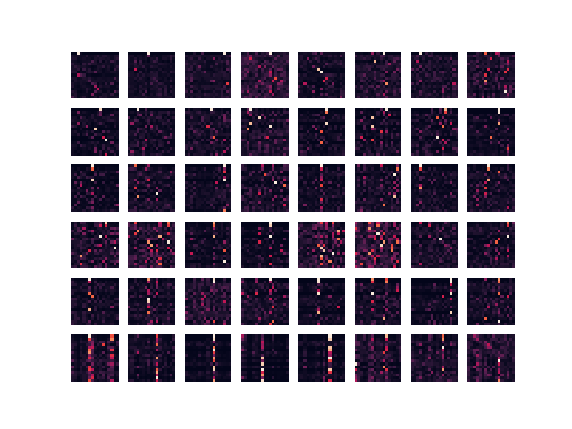
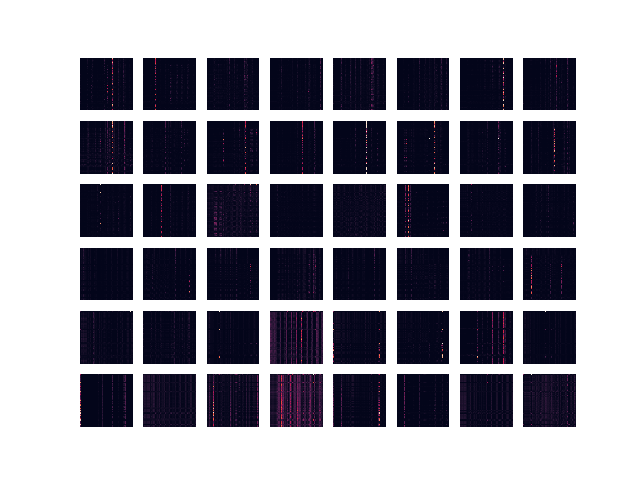

Article to implement: [transformers](https://arxiv.org/pdf/2010.11929.pdf) \
Original article about transformers: [original](https://arxiv.org/pdf/1706.03762.pdf)

Build docker container:

- ```docker build -t transformers . ```
- ```docker run -it --name transformers transformers```

If exited:
- ```docker start transformers && docker exec -it transformers bash```

Run program:

- train ```python train_model.py --dataset mnist```
- test  ```python test_model.py --dataset mnist --image-path xxx --weights-path xxx```

Available options:

- ```--dataset - mnist or fruit```
- ```--image-path - sample_images/fruits.jpg or sample_images/mnist.jpg```
- ```--weights-path - weights/fruit.ckpt or weights/mnist.ckpt```


Link to colab for visualizing attention: ```https://colab.research.google.com/drive/1HrAGgFe5pOVUDDzNxUgGoC4vqHiRLgp7?usp=sharing``` (not forget to upload ```kaggle.json``` to colab).

Limitation of the project:
- unable to train extensively on fruit dataset - colab training speed islow because of slow google disk.
- unable to display attention maps after training because ```matplotlib.pyplot``` does not display plots in script mode, only using jupyter notebook.
- mnist dataset, which I download using ```torchvision.datasets.MNIST``` sometimes could be unavailable (server throws Timeout) -> need to wait and try ones again.


Visualization of attention:

- ```mnist``` (this pic shows more attention probably because I have trained fruits only on 2 epochs)

  


- ```fruit```

  
  
  
  Any problems with docker/script - feel free to open issue or contact me via telegram: @homomorfism
